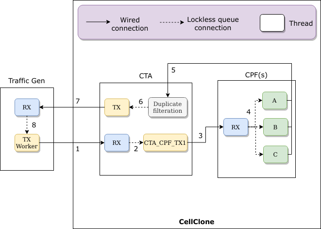
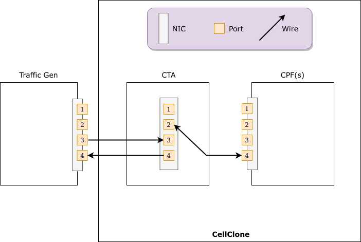
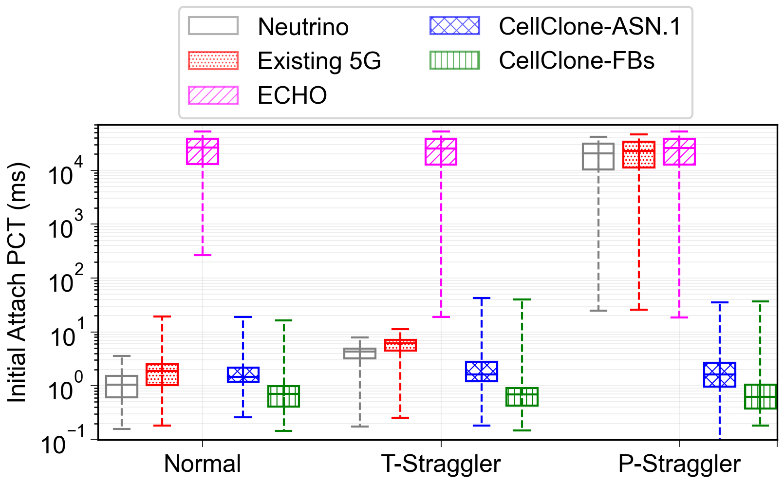

# :cyclone: CellClone :cyclone:

## Overview
The README explains how to setup and configure CellClone for experiements. We briefly provide system level overview of the CellClone. The README is divided into three sections:
1. [System Overview](#system-overview)
2. [System Setup](#system-setup) 
3. [Experiments execution](#experiments-execution)

## System Overview
<div align="center" id="fig1">
    
    <p>&nbsp;&nbsp;&nbsp;&nbsp;&nbsp;&nbsp;&nbsp;&nbsp;&nbsp;&nbsp;&nbsp;&nbsp;&nbsp;&nbsp;&nbsp;&nbsp;&nbsp;&nbsp;&nbsp;&nbsp;&nbsp;&nbsp;&nbsp;&nbsp;&nbsp;&nbsp;&nbsp;&nbsp;&nbsp;&nbsp;&nbsp;Fig 1: Simplified CellClone experimental setup</p>
</div>

Figure 1 shows the simplified CellClone experimental setup. As depicted in the figure, the system has three components -- Control Traffic Generator, Control Traffic Aggregator (CTA) and Control Plane Function (CPF). Brief explanation of each component is given below.

### Control Traffic Generator
The control traffic generator simulates both User Equipment (UE) and Base Station (BS). The control traffic generator in our case replays the real control traces of the control procedures such as Initial Attach, Handover and Service Establishment. As shown in the figure, there are two types of threads in the control traffic generator: TX Worker threads and RX thread. TX worker threads are responsible for starting the control procedures in either uniform or bursty mode. The RX thread is in control of receiving the response messages from the CTA. Once the RX thread receives messages from the CTA, it forwards them to a specific TX Worker thread via lockless queues. The TX Worker thread then prepares and sends the next message of the procedure to the CTA.

Links to the control traffic generator functions from the [Fig 1](#fig1),
- [TX Workers (uniform)](https://github.com/nsgLUMS/cellclone/blob/76bda37e84fac560261531c7ac60ec2f3cf3ff48/src/pktgen/main.c#L249) and [TX Workers (bursty)](https://github.com/nsgLUMS/cellclone/blob/76bda37e84fac560261531c7ac60ec2f3cf3ff48/src/pktgen/main.c#L333) 
- [RX](https://github.com/nsgLUMS/cellclone/blob/76bda37e84fac560261531c7ac60ec2f3cf3ff48/src/pktgen/main.c#L418)

### Control Traffic Aggregator (CTA)
The function of CTA in our design is to forward and receive control messages from appropriate CPFs. It has two communication paths: 1). Control Traffic Generator to CPFs 2). CPFs to Control Traffic Generator. The first path, Control Traffic Generator to CPFs, has two types of threads: RX and TX threads. RX thread is responsible for receiving messages from the Control Traffic Generator. The TX threads receive messages from the RX thread and forward them to an appropriate CPF. The CTA uses DPDK APIs for CTA to CPFs communication. The second path is responsible for the reception of messages from the CPFs. The Duplicate filtration thread receives messages from the CPFs, keeps track of and removes the duplicate messages, and sends the remaining messages to the TX thread. The only purpose of TX thread is to send the messages back to the Control Traffic Generator via DPDK APIs.

Links to the CTA functions from the [Fig 1](#fig1),
 - [RX](https://github.com/nsgLUMS/cellclone/blob/76bda37e84fac560261531c7ac60ec2f3cf3ff48/src/core/cta/main.c#L500) 
 - [CTA_CPF_TXs](https://github.com/nsgLUMS/cellclone/blob/76bda37e84fac560261531c7ac60ec2f3cf3ff48/src/core/cta/main.c#L396) 
 - [Duplicate filtration](https://github.com/nsgLUMS/cellclone/blob/76bda37e84fac560261531c7ac60ec2f3cf3ff48/src/core/cta/main.c#L134) 
 - [TX](https://github.com/nsgLUMS/cellclone/blob/76bda37e84fac560261531c7ac60ec2f3cf3ff48/src/core/cta/main.c#L246) 

### Control Plane Function (CPF)
CPF in our design represents the Access and Mobility Management Function (AMF) and Session Management Function (SMF) in 5G system architecture. The CPF implements state machines for both NAS and NGAP procedures. As depicted in the figure, the RX thread receives messages from the CTA through DPDK APIs and forwards them to the appropriate CPF. The CPF processes the messages and returns the responses to CTA. 

Links to the CPFs functions from the [Fig 1](#fig1), 
- [RX](https://github.com/nsgLUMS/cellclone/blob/76bda37e84fac560261531c7ac60ec2f3cf3ff48/src/core/cpf/main.c#L160) 
- [CPF](https://github.com/nsgLUMS/cellclone/blob/76bda37e84fac560261531c7ac60ec2f3cf3ff48/src/core/cpf/src/workers/workers.cpp#L123) 

## System Setup

As shown in [Figure 1](#fig1), three servers are required for CellClone setup. Our test setup consists of servers running Ubuntu 18.04.3 with kernel 4.15.0-74-generic. Each server is a dual-socket with 18 cores per socket, Intel Xeon(R) Gold 5220 CPU @ 2.20 GHz, and with a total memory of 128 GB. All servers are also equipped with Intel X710 40 Gb (4 x 10) NIC.

Below are required steps to run CellClone:
1. [Cables and Ports configuration](#cables-and-ports-configuration)
2. [DPDK Setup](#dpdk-setup) 
3. [External Libraries](#external-libraries) 
4. [CellClone Setup](#cellclone-setup)
5. [Servers Configuration](#servers-configuration)

### Cables and Ports configuration

[Figure 2](#fig2) shows default NIC ports configuration used in CellClone which can be updated from the code. We have used [10 Gb SFP + ethernet cables](https://www.connection.com/product/extreme-networks-10-gigabit-ethernet-sfp-passive-cable-1m/10304/16268319). Code for [Control Traffic Generator](https://github.com/nsgLUMS/cellclone/blob/66a34a28d0b0bb5a1a5c9a4b3a1f846ee2c49663/src/pktgen/helper/globals.h#L13), [CTA](https://github.com/nsgLUMS/cellclone/blob/66a34a28d0b0bb5a1a5c9a4b3a1f846ee2c49663/src/core/cta/Common/globals.h#L8) and [CPF](https://github.com/nsgLUMS/cellclone/blob/66a34a28d0b0bb5a1a5c9a4b3a1f846ee2c49663/src/core/cpf/Common/globals.h#L8) can be accessed by clicking the relevant links.

<div align="center" id="fig2">
    
    <p>&nbsp;&nbsp;&nbsp;&nbsp;&nbsp;&nbsp;&nbsp;&nbsp;&nbsp;&nbsp;&nbsp;&nbsp;&nbsp;&nbsp;&nbsp;&nbsp;&nbsp;&nbsp;&nbsp;&nbsp;&nbsp;&nbsp;&nbsp;&nbsp;&nbsp;&nbsp;&nbsp;&nbsp;&nbsp;&nbsp;&nbsp;&nbsp;&nbsp;&nbsp;&nbsp;&nbsp;&nbsp;&nbsp;&nbsp;&nbsp;Fig 2: Cables and Ports configuration</p>
</div>

### DPDK Setup

Data Plane Development Kit (DPDK) is a library to accelerate the packet processing workloads. In order to install DPDK, you need to perform the following steps on all three servers:

1. Download DPDK 17.11 by running the following command: <br/> `wget https://github.com/DPDK/dpdk/archive/v17.11.tar.gz`
2. Extract the `.tar.gz` file in a folder.
3. Navigate to `dpdk-17.11/usertools`.
4. Execute `dpdk-setup.sh` file using the command: <br/>
`sudo ./dpdk-setup.sh`
5. From the `Step 1: Select the DPDK environment to build` section, select right system architecture and compiler. For us it was _[14] x86_64-native-linuxapp-gcc_
6. Insert the driver, we used _[17] Insert IGB UIO module_
7. Setup hugepages, we used NUMA system so _[21] Setup hugepage mappings for NUMA systems_.
The number of huge pages depends on the system's memory. We used to run experiments with 30,000 hugepages, each of 2kB. Later on, we used 1GB hugepages, total of 100.
8. Bind ports, _[23] Bind Ethernet/Crypto device to IGB UIO module_.
9. Lastly, add following lines to the `/etc/environment` file:
```
RTE_SDK="path_to_dpdk/dpdk-17.11"
RTE_TARGET="x86_64-native-linuxapp-gcc"
```

### External Libraries

The CTA and CPF use a C++ [Libconfig](https://github.com/hyperrealm/libconfig) library to manage the system's configuration files. In order to install it, you need to execute following commands:

```
sudo apt-get update -y
sudo apt-get install -y libconfig-dev
```

### CellClone Setup

Perform the following steps to setup CellClone:
1. Clone the CellClone repository on all three servers.
2. At the Control Traffic Generator server, navigate to [Control Traffic Generator](https://github.com/nsgLUMS/cellclone/tree/master/src/pktgen) folder and run the following commands:
```
sudo make clean
sudo make
```
3. At the CTA server, navigate to [CTA](https://github.com/nsgLUMS/cellclone/tree/master/src/core/cta) folder and run the `sudo make clean && sudo make`.
4. Similarly, at the CPF server, navigate to [CPF](https://github.com/nsgLUMS/cellclone/tree/master/src/core/cpf) folder and execute `sudo make && sudo make`.

## Servers Configuration

Open [servers_configuration.json.sample](https://github.com/nsgLUMS/cellclone/blob/master/src/pktgen/servers_credentials.json.sample) and fill out the credentials of your servers. After that, rename `servers_credentials.json.sample` to `servers_credentials.json`.

## Experiments Execution

We show the steps to reproduce the following figure of our paper.

<div align="center" id="fig3">
    
    <p>&nbsp;&nbsp;&nbsp;&nbsp;&nbsp;&nbsp;Fig 11: Initial Attach PCT comparison. Initial Attach involves multiple non-deterministic operations.</p>
</div>

Figure 11 shows the evaluation of five systems (_Neutrino_, Existing 5G, ...) under three types of scenarios (_Normal_, _T-Straggler_, _P-Straggler_). Here, we will be reproducing the results of _CellClone-ASN.1_ under all three scenarios. The evaluation of remaining systems follows similar steps.

### Steps to reproduce CellClone results

1. First, naviagte to [exps](https://github.com/nsgLUMS/cellclone/tree/master/exps) folder and open [config.json](https://github.com/nsgLUMS/cellclone/blob/master/exps/config.json) file.
2. The provided config file reproduces the _CellClone-ASN.1_ results from [Figure 11](#fig3). Let's explore which variables are relevant in this experiemnt. Note: please do not change variables not explained here. 
    - `bursty`: `false` means the Control Traffic Generator will replay the cellular traffic in uniform rate i.e., messages per second.
    - `remote_cpfs`: `2` means that out of the specified number of CPFs, __2__ are remotely deployed while the remaining (if any) are locally deployed.
    - `replicas`: `3` means a single message will be forwarded to exactly __3__ CPFs.
    - `remote_replicas`: `2` means a single message will be forwarded to exactly __2__ remote CPFs and __1__ local CPFs out of three __3__ aforementioned CPFs (should enough remote and local CPFs exist).
    - `tx_arg`: denotes the write quoram. For instance, `1` would mean that the CTA will wait for the write response of atleast __1__ CPF before forwarding the response to the UE.
    - `delay`: denotes the additional propogation delay incurred during the transmission of packets from a remote CPF to CTA (in microseconds).
    - `cpfs_action`: describes how each CPF will behave. For instance, `{"1": "straggler", "type": 2}` hash has two key-value pairs. First key-value means first CPF will behave as a straggler. Whereas, second key-value pair indicates the type of staggler first CPF will behave as. Types of stragglers are given below,
        - `type`: `0` => T-straggler
        - `type`: `1` => P-straggler
        - `type`: `2` => No straggler
    - `scheme`: `asn1` means [ASN.1](https://en.wikipedia.org/wiki/ASN.1) message encoding scheme will be used. It can take either `asn1` or `fb`.
    - `procedure`: `attach` means _Attach_ control procedure is being replayed. It can take `attach`, `handover`, `service` or `dpcm_service`.
3. Navigate to [pktgen](https://github.com/nsgLUMS/cellclone/tree/master/src/pktgen) folder and replace the `config.json` in this directory with the previously discussed `config.json` file.
4. Execute `sudo python3 run_experiments.py --clean --cta --pktgen` command in the same folder.
5. Wait for a few minutes for the experiment to finish. When finished, execute `sudo python3 do_stats.py` command. Copy the results and replace the first row in [cellq_asn1.txt](https://github.com/nsgLUMS/cellclone/blob/master/exps/attach/cellq_asn1.txt) file. The first results row in the file belongs to _Normal_, second to _T-Straggler_ and last to _P-Straggler_.
6. Repeat the same experiment for _T-Straggler_ and _P-Straggler_ by changing the `config.json` file and executing step __4__ and __5__.
7. When done, you will have three rows for _Normal_, _T-Straggler_ and _P-Straggler_ in [cellq_asn1.txt](https://github.com/nsgLUMS/cellclone/blob/master/exps/attach/cellq_asn1.txt) file.
8. Navigate to [exps](https://github.com/nsgLUMS/cellclone/tree/master/exps) folder, open [command.txt](https://github.com/nsgLUMS/cellclone/blob/master/exps/command.txt) file, copy the command and run in the same folder. You will get [Fig 3](#fig3) like image, except with updated `CellClone-ASN.1` results.
